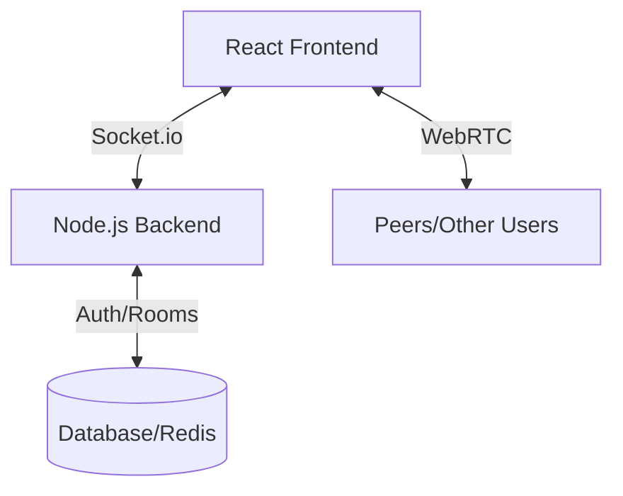

# Implementation Plan: Gather.town Replica

This document outlines the architecture, tech stack, and step-by-step approach to building a proximity-based 2D video chat platform like Gather.town.

## 🏗️ Architecture Overview

The application consists of three main layers:
1.  **Game Layer**: A 2D top-down tiled world where users move their avatars (Phaser.js/Canvas).
2.  **Real-time Sync Layer**: WebSockets (Socket.io) to synchronize avatar positions, animations, and chat among users.
3.  **Communication Layer**: WebRTC (Simple-Peer or MediaSoup) for peer-to-peer audio/video chat triggered by proximity.

---

## 🛠️ Technology Stack

| Component | Technology | Why? |
| :--- | :--- | :--- |
| **Frontend** | React, TypeScript | For modern, type-safe UI management. |
| **Game Engine** | Phaser.js | Robust 2D engine perfect for tile-based RPG movement. |
| **Backend** | Node.js, Express, TypeScript | Scalable and easy to integrate with Socket.io. |
| **Real-time API**| Socket.io | Reliable real-time events for movement and chat. |
| **Video/Audio** | Simple-Peer / WebRTC | Standard for P2P media streaming. |
| **Styling** | Vanilla CSS / Tailwind | Flexible and modern styling. |

---

## 📅 Phased Development Approach

### Phase 1: The Foundation (2D World & Movement)
1.  **Project Setup**: Initialize React (Frontend) and Node.js (Backend) with TypeScript.
2.  **Basic Tiled Map**: Use Tiled (Map Editor) to create a simple PNG-based or JSON-based tilemap.
3.  **Avatar Movement**: Implement local avatar controls (WASD/Arrows) and collision detection with Phaser.js.
4.  **Backend Socket Integration**: Set up Socket.io to broadcast movement updates to other connected clients.

### Phase 2: Social Interactions (Proximity & Chat)
1.  **Proximity Masking**: Calculate distances between the local user and other users.
2.  **Audio/Video Toggling**: Only enable media streams when two avatars are within a certain "interaction radius".
3.  **Real-time Chat**: Implement a simple global or room-based chat using Socket.io.

### Phase 3: Advanced Features & Polish
1.  **Room Customization**: Persistent room states and object interactions.
2.  **Avatar Customization**: Choosing different sprites or colors.
3.  **UI/UX Refinement**: Modern dashboards, profile settings, and room lists.

---

## 🚀 Getting Started

1.  **Initialize Backend**:
    - `npm init -y`
    - Install `express`, `socket.io`, `typescript`, `@types/node`, etc.
2.  **Initialize Frontend**:
    - `npx create-react-app --template typescript .` (or Vite equivalent)
    - Install `phaser`, `socket.io-client`.
